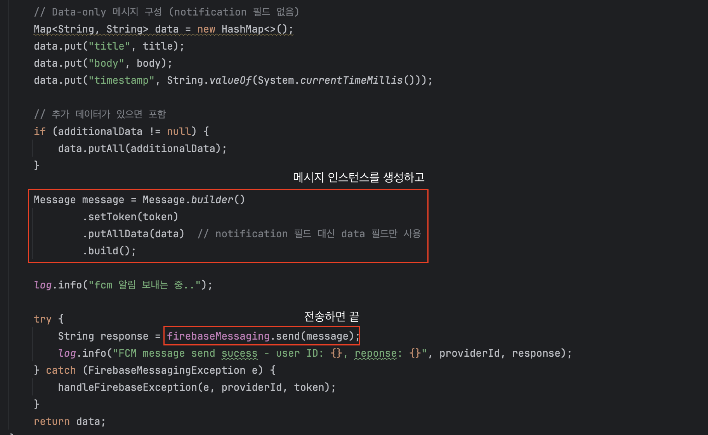

안녕하세요. 전 요즘 선행을 기록하는 [흔적](https://github.com/Warm-Trace/Trace_Backend)에 백엔드로 합류하여 앱 출시를 바라보면서 개발하고 있습니다. 최근에는 알림 탭 기능을 구현하게 되어 관련 작업을 맡고 있습니다. 이 과정에서 FCM(Firebase Cloud Messaging)을 사용한 기능을 개발하며 학습하고 정리한 내용을 공유하고자 합니다.

> 이 글을 읽은 후엔 FCM의 개념, 아키텍처, 백엔드에서 메시지를 전송하는 방식에 대해 이해할 수 있습니다. 

<!--truncate-->


# Firebase Cloud Messaging
FCM은 메시지를 안드로이드, IOS, 웹 환경에서 안정적인 메시지 교신을 돕는 크로스 플랫폼 메시징 솔루션입니다. 안드로이드, IOS, 웹에서 메시지를 수신하는 방식이 다르지만, FCM을 사용하면 하나의 통합된 인터페이스를 통해 다양한 플랫폼으로 메시지를 전송할 수 있습니다. 

그렇다면 왜 FCM을 써야할까요? 안드로이드에선 과거 GCM을 사용하였지만 서비스가 공식적으로 종료되고 FCM으로 완전히 대체되었습니다. IOS도 APNs(Apple Push Notification Service)를 사용하면 되지만 방식이 꽤나 복잡하다고 합니다. 웹은 복잡하고 모바일과 연동이 좋지 않죠. 이렇듯 FCM은 플랫폼에 종속적이지 않고, 푸시 알림을 쉽게 전송할 수 있다는 장점이 있습니다.

# FCM Architecture
구조는 간단하며 덕분에 저희가 해야할 일은 아주 간단합니다. GUI 기반 Firbase 콘솔이나 자신의 애플리케이션에서 메시지 인스턴스를 생성한 후 FCM Backend 서버에 송신하기만 하면 됩니다. 


(GUI 환경보다 서버 환경을 기준으로)

```
1. Admin SDK를 사용하거나 직접 HTTP 통신으로 FCM 백엔드 서버에 메시지를 송신(요청)
--> 2. FCM 백엔드에서 요청을 받아서 메시지를 처리
----> 3. 타게팅된 기기로 메시지 라우팅 & 플랫폼에 맞게 (IOS - APNs, Web - WebPush) 알아서 처리됨
------> 4. 사용자의 기기에 알림이 표시
```

메시지를 전송할 때는 FCM HTTP v1 API를 이용해야 하며, FCM에서 요구하는 DTO 형식에 맞추어서 메시지를 작성하고, 전송해야합니다. Admin SDK를 사용하는 경우엔 메서드만 호출하면 자동으로 FCM HTTP v1 API에 맞게 호출하지만, 만약 원시 서버 프로토콜을 통해 개발하길 원한다면 FCM HTTP v1 API을 따라야합니다. 따라서 Node, Java, Python, C#, Go를 사용하지 않는다면 고생 좀 해야한다..

Spring Boot를 사용한 이번 프로젝트에선 아래의 의존성을 추가한 후 사용하였습니다. 

``` groovy
implementation 'com.google.firebase:firebase-admin:9.3.0'
```

실제 구현된 코드를 보자. builder를 통해 Message 인스턴스를 생성하고 FirebaseMessaging의 send메서드로 전송하면 FCM 백엔드 서버로 전송이 완료된다.



## Messages Type
FCM에서 제공하는 메시지 타입은 두 가지다. 

- 알림 메시지(Notification) : FCM SDK에서 자동으로 처리
- 데이터 메시지(Data) : 클라이언트 앱에서 처리

**알림 메시지**는 `title`과 `body`만을 키로 가져야하며 예외는 없다. 알림 메시지를 전송하면 메시지 형식은 바꿀 수 없지만, 앱이 백그라운드 상태에서도 알림 메시지가 알림 목록으로 전송되는 이점이 있다. 물론 포그라운드 상태여도 수신 가능하다.

```json
{
  "message":{
        "token": "bk3RNwTe3H0:CI2k_HHwgIpoDKCIZvvDMExUdFQ3P1...",
        "notification": { # 여기!
            "title":"Portugal vs. Denmark",
            "body":"great match!"
        }
  }
}
```

**데이터 메시지**는 커스텀 key-value 쌍으로 메시지 페이로드를 전송한다. 이 방식에선 안드로이드 전송 레이어(아키텍처 사진의 3번째)는 엔드 투 엔드 암호화를 추가할 수 있다. 하지만 FCM에서 제공하는게 아니라 Capillary 또는 DTLS 같은 외부 라이브러리를 통해서 추가해야한다.

```json
{
  "message":{
    "token":"bk3RNwTe3H0:CI2k_HHwgIpoDKCIZvvDMExUdFQ3P1...",
    "data":{  # 여기!
      "Nick" : "Mario",
      "body" : "great match!",
      "Room" : "PortugalVSDenmark"
    }
  }
}
```

하지만 앱이 백그라운드 상태라면 알림 표시가 자동으로 처리되지 않는다. 포그라운드 상태에선 자동으로 처리된다. 만약 백그라운드 상태에서도 알림 목록에 수신하고 싶은 경우 `notification`키와 `data`키 둘 다 포함된 JSON 형식 메시지를 사용하면 된다. 


## 메시지 우선순위
메시지에 우선순위를 주어 먼저 전송되거나 무조건 수신되게 할 수도 있다. FCM 백엔드 서버는 메시지 큐를 가지고 있고 클라이언트 디바이스에 적절히 메시지를 보낸다. 우선순위는 "normal"과 "high" 가 있다. 

normal : 앱이 포그라운드면 즉시 전송, 백그라운드인 경우 전송 지연
high : 기기가 잠자기 모드인 경우에도 메시지를 전송하려고 시도 (Apple 기기엔 사용할 수 없음)
메시지에 우선순위를 높게 설정하면 큐에서 우선적으로 송신될 수도 있다. 우선순위가 가지는 의미는 전송 지연 없이, 기기가 잠자기 상태여도 전송시키는 것이지, 무조건 먼저 우선적으로 전송시킨다는 건 아니다.


# FCM을 알게 되었나요
FCM은 플랫폼에 종속되지 않고 푸시 알림을 전송할 수 있는 메시징 솔루션이다. 정해진 메시지 형식을 전송하기만 하면 원하는 기기에 푸시 알림이 수신되게 한다. 

### 참고
[Firebase Cloud Messaging 공식 문서](https://firebase.google.com/docs/cloud-messaging?hl=ko&_gl=1*cjtoyb*_up*MQ..*_ga*MTM3NzIxNTkzMy4xNzUzMDkxNDg5*_ga_CW55HF8NVT*czE3NTMwOTU0ODckbzIkZzAkdDE3NTMwOTU2MzckajYwJGwwJGgw)