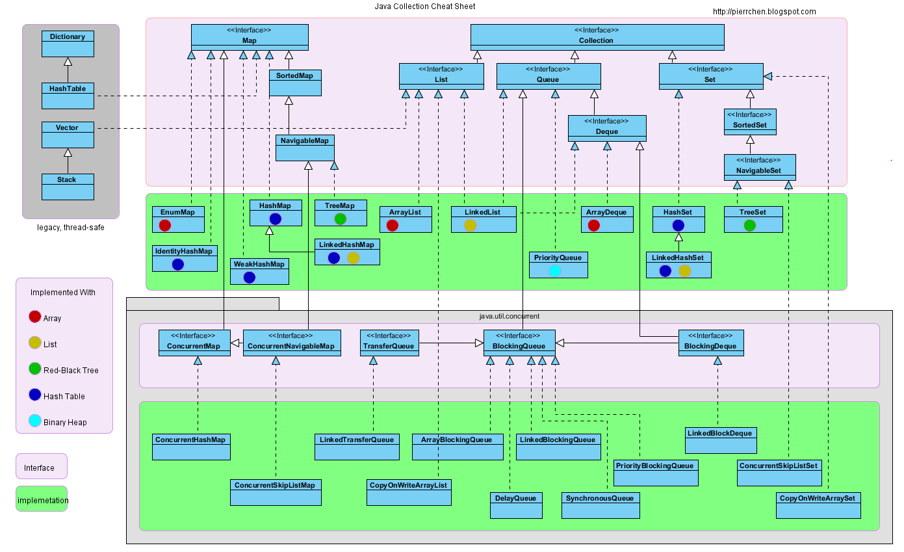

> 이 글을 읽은 후엔 HashMap과 TreeMap의 차이를 알고 요구사항에 맞게 더 적절히 사용할 수 있습니다.

<!--truncate-->

# HashMap
- 순서없음

- 평균 O(1)

- null 키 허용

HashMap은 해시 기반의 구현체로서 AbstractMap을 확장하고 Map을 구현한다.

해시 값으로 데이터에 접근하므로 값을 삽입하고 검색하고 삭제하는 연산 모두 O(1)의 시간 복잡도를 가진다. 하지만 최악의 경우 삽입되는 모든 데이터에 해시 충돌되면 모든 데이터가 연결 리스트로 관리되기 때문에 O(n)의 시간 복잡도를 가지게 된다.

말이 너무 어려우니 코드를 한번 살펴보자.

  

이 녀석은 내부적으로 `Node<K, V>[] table`이라는 배열을 가지고, 이 배열 안에 HashMap의 모든 데이터가 저장된다. 각 노드에는 다음 노드를 가리키는 참조와 키&값이 존재한다.

  

값을 삽입하거나 값에 접근할 때엔 hashCode % capacity로 인덱스를 정해서 그 bucket에 데이터를 넣는다.(실제로는 %연산이 아니라 비트 연산)

  

for문을 돌다가 if(p.next == null)이면 p.next에 newNode를 넣는 것이 보이는가? 이것은 충돌이 일어났을 때 해당 버킷의 연결리스트에 append하는 로직이다. 그리고 새로운 값을 넣은 후 어떤 조건을 만족한다면 treeify를 하는데 이건 조금 뒤에서 설명한다.

HashMap은 hashCode()를 사용하여 데이터를 분류하기 때문에 해쉬 충돌이 발생하게 되면 버킷화된 해시 테이블로 동작한다.  Java 8 이전에는 Separate Chaining으로 충돌을 해결하여서 연결 리스트로 구현되어 최악의 경우 O(n)의 시간복잡도를 가졌다. 하지만 [JEP 180](https://openjdk.org/jeps/180)이 도입되면서 버킷이 너무 커진다면  TreeNodes로 변환되고 각 노드는 TreeMap의 노드와 유사하게 구조화되어 최악의 경우에도 O(log n)의 시간복잡도를 가지게 되었다. 

TreeNode는 일반 Node보다 메모리를 2배 많이 차지한다. 그래서 일정 크기(8개) 이상일 때만 트리로 바뀌고 다시 작아지면 리스트로 되돌아간다. 공식 구현 문서에는 해시가 잘 분포되어 있다면(이상한 해시코드를 생성하지 않는다면) 이런 상황은 거의 안 생긴다고 한다.

흥미로운 점은 해시값이 랜덤하게 분포되었다고 가정하면 한 버킷에 몇 개의 노드가 들어갈지는 포아송 분포를 따른다고 한다. 

예를 들어, 한 버킷에

- 원소가 0개일 확률 ≈ 60%
- 원소가 1개일 확률 ≈ 30%
- 원소가 2개일 확률 ≈ 7%
- 원소가 8개 이상일 확률 ≈ 천만 분의 1보다 낮음

즉, 트리화(treeify)는 매우 예외적인 상황일 뿐이라는 걸 보여준다.

hashCode는 기본 참조타입에 대해선 작성할 필요없지만 자신이 생성한 클래스에 대해선 반드시 생성해야한다. 그래야만 효율적인 HashMap을 사용할 수 있다. hashCode를 재정의 할 때 일관성, 동등성 보존, 비동등성 분리를 지키면서 소수와 각 필드의 hashCode를 더해야한다. 사실 좀 더 복잡한데 여기서는 생략하겠다.

HashMap은 내부적으로 해시 버킷 배열을 사용하기 때문에, 실제 데이터 양보다 더 많은 메모리를 필요로 한다. 일반적으로 해시 충돌을 줄이고 성능을 유지하기 위해 70%~75% 이상 채워지지 않도록 설계되며, 이 한계에 가까워지면 자동으로 크기가 조정되고 모든 항목이 다시 해시되는 과정(rehashing)이 발생한다. 하지만 리해싱은 N개의 원소를 다시 배치해야 하므로 비용이 크다. 따라서 HashMap의 성능은 객체를 생성할 때 적절한 초기 용량과 부하 계수(load factor)를 설정하느냐에 크게 좌우된다.

 
 

# TreeMap
- 키 기준 자동 정렬(오름차순)

- O(log n)

- null 키는 불가, 값은 허용

- Red-Black Tree

TreeMap은 Red-Black Tree 기반의 NavigableMap 구현체로 키를 기준으로 정렬된 상태를 유지하는 Map이다. 정렬을 위한 값 비교를 위해 `Comparable`을 구현하거나 `Comparator`를 사용해야 한다. 

`containsKey`나 `get`, `put`, `remove`시 log(n)의 시간복잡도가 소요된다. 내부적으로 트리를 사용하니 당연한 결과이다.

TreeMap이나 TreeSet은 `NavigableMap`이나 `NavigableSet` 인터페이스를 구현하고 있다. 그래서 Map으로 받는게 아닌 NavigableMap으로 받으면 ceilingEntry, floorEntry, higherKey, lowerKey 와 같은 탐색 관련 메서드를 사용할 수 있다. 이는 조회하고자 하는 객체와 가장 가까운 값을 찾는 메서드로 Tree만의 특성을 이용한 것이다. 그래서 TreeMap이나 TreeSet은 NavigableMap, NavigableSet으로 받아 사용하는게 좀 더 유용할 것이다.!

앞서 TreeNode는 일반 Node보다 두 배 더 많은 메모리를 차지한다고 했다. 그렇다면 모든 노드가 TreeNode인 TreeMap은 HashMap보다 두 배 더 많은 메모리를 차지할까?

그건 아니다. TreeMap은 각 노드에 참조가 많아 기본적으로 무겁진하지만 HashMap과 다르게 별도의 버킷 배열이 없으므로 무조건 메모리를 더 많이 쓴다고 단정짓기 어렵다. 버킷 배열이 없으므로 Load Factor도 존재하지 않는다. 트리 구조이기 때문에 버킷 크기라는 개념이 존재하지 않고, 버킷 재해싱(resize & rehash)이 필요없다. 

레드 블랙 트리는 편향(skid) 트리가 되지 않도록 균형을 강제한다. 그래서 구현이 복잡하고, 데이터 삽입/삭제마다 회전과 색깔 변경을 해야한다. 

 
 

# Concurrent Access
HashMap과 TreeMap은 멀티 스레드 환경에서 동기화가 보장되기 않기 때문에 여러 스레드가 동시에 접근할 경우 Race Condition과 같은 문제가 발생할 수 있다.

이를 해결하기 위해선 `Collections.synchronizedMap()` or `Collections.synchronizedSortedMap()`으로 명시적으로 감싸서 사용해야한다. 

HashMap의 경우 `ConcurrentHashMap<>()`을` 사용하는 것이 더 나은 방법이다. 이는 읽기 연산 락이 없어서 get()으로 여러 스레드에서 동시 접근이 가능하고, 쓰기 연산 락이 있어 put, remove 시에 해당 버킷만 잠금된다. 세그먼트(버킷) 단위 락이 있어 전체 맵이 아닌 특정 버킷만 락을 건다. 

TreeMap 또한 멀티 스레드 환경에서 동기화를 지원하지 않는다. 따라서 여러 스레드가 동시에 접근하면서 수정까지 한다면 외부에서 동기화 처리를 해줘야한다. 예를 들어 `Collections.synchronizedSortedMap()`으로 감싸서 사용할 수 있다.

 
 

# 그래서 뭐가 더 낫지?
둘은 사용하는 목적이 다르기 때문에 어느 것이 더 좋다라는 건 없다. 요구사항에 맞게 더 나은 선택지를 사용하면 된다.

결론을 말하자면 빠른 검색엔 HashMap, 정렬 혹은 범위 검색이 필요하면 TreeMap을 사용하자.